# Check Management

Incoming and outgoing checks for Odoo 18: post-dated checks (PDC), deposits, collection, bounces, endorsement,
bank discounting, guarantees, custody, checkbooks and multi-stage approvals. Every accounting entry is posted and
reconciled automatically.

| | |
|---|---|
| **Technical name** | `sa_check_management` |
| **Version** | 18.0.1.14.0 |
| **Depends on** | `account_accountant`, `mail` |
| **License** | OPL-1 |
| **Author** | Sayed Anwar |
| **User guides (PDF)** | [English](static/description/sa_check_management_user_guide_en.pdf) · [Arabic, Modern Standard](static/description/sa_check_management_user_guide_ar_msa.pdf) · [Arabic, Egyptian](static/description/sa_check_management_user_guide_ar.pdf) |

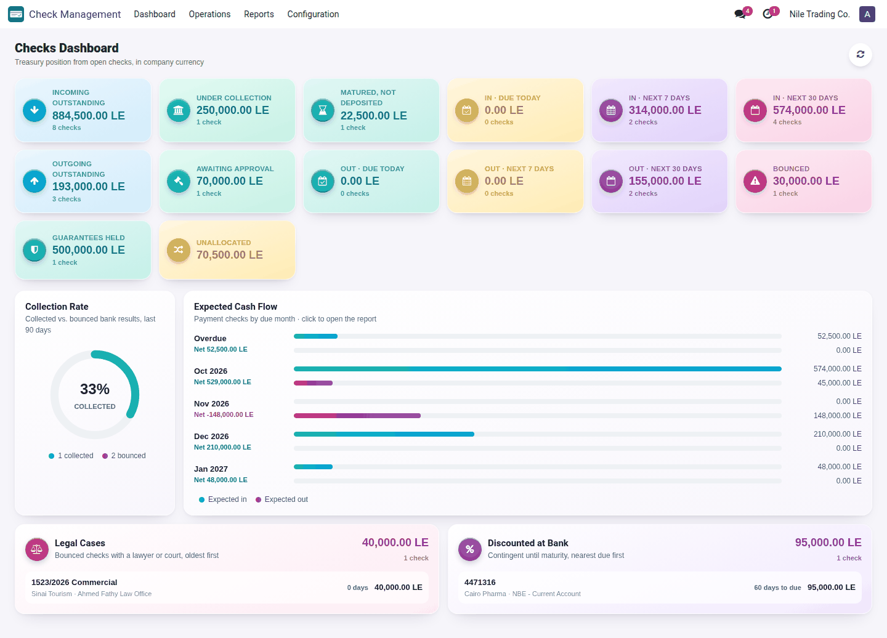

## The suite

This is the core module. Two optional add-ons build on it:

- **Check Management - Check Printing** (`sa_check_management_print`) prints outgoing checks on the bank leaf.
- **Check Management - Sales** (`sa_check_management_sale`) warns about or blocks sales to customers with bounced checks,
  and counts open checks in the credit limit. It installs itself when Sales is installed.

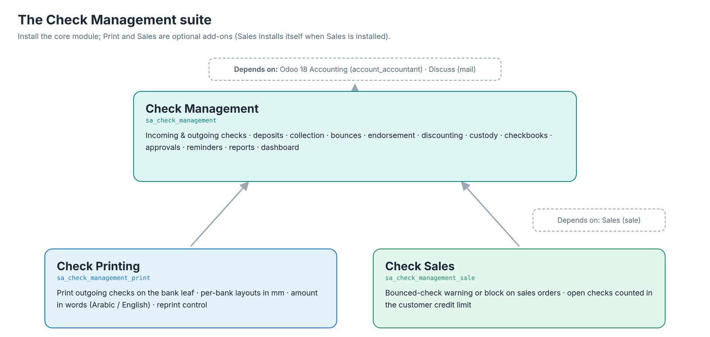

## Features

- **Incoming checks**: receive post-dated customer checks, allocate them to invoices, deposit them in batches, record
  collection or bounce, re-deposit, take legal action, replace, settle or return.
- **Outgoing checks**: write vendor checks from registered checkbooks, send them through approval stages, issue, deliver,
  present and clear them; stop payment, bank rejection, lost and stale checks.
- **Automatic accounting**: Checks Receivable / Payable (PDC), under collection, discount and bank-fee entries are posted
  and reconciled for you. Matching a bank statement line closes the check by itself.
- **Endorsement** of customer checks to vendors against their bills.
- **Bank discounting** with per-bank advance rate, annual interest and fixed fee.
- **Guarantee and security checks** with expiry alerts and optional off-balance memorandum entries.
- **Custody**: who physically holds each check, with handovers the receiver must accept.
- **Checkbooks**: leaf ranges or imported leaf lists, reserved, used, voided, lost or damaged.
- **Approvals**: amount-based approval stages for outgoing checks, plus approval requests for sensitive actions.
- **Control**: role-based permissions, segregation of duties, duplicate-number detection, fields locked after Draft,
  an immutable history per check, and a review flag when someone changes a check entry from Accounting.
- **Dashboard and reports**: KPIs, expected cash flow, maturity aging, bounce analysis, legal cases, check history, and
  printable voucher, deposit slip, handover receipt, legal case sheet and partner check statement.
- **Reminders**: daily to-dos with escalation to Check Managers.
- **Legacy import** from Excel or CSV.
- Multi-company, multi-currency, English and Arabic.

## Getting started

### 1. Install

Install **Check Management** from *Apps*. The company needs a chart of accounts first. On install (and on the first
posting if anything is missing) the module creates the *Checks Receivable (PDC)* and *Checks Payable (PDC)* accounts,
a *Checks Portfolio* journal and the *Check* payment method lines. You can point the settings at your own accounts instead.

### 2. Give people a role

*Settings → Users & Companies → Users* → open a user → **Check Management** section.

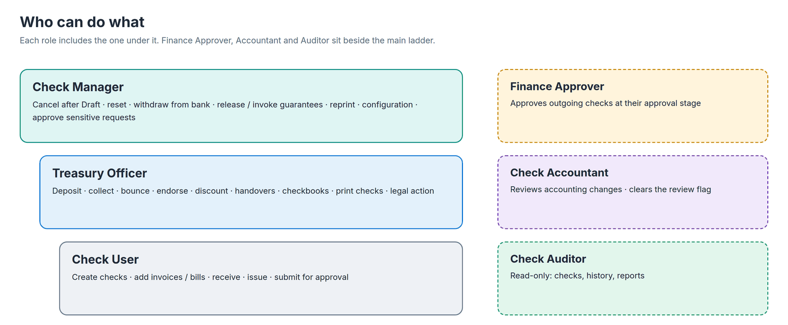

| Role | Typical person | Can do |
|---|---|---|
| Check User | Accountant, sales admin | Create checks, add invoices/bills, receive, issue, submit for approval |
| Treasury Officer | Treasurer, cashier | Everything above + deposit, collect, bounce, endorse, discount, handovers, checkbooks, print checks, legal action |
| Check Manager | Finance manager | Everything above + cancel after Draft, reset to Draft, withdraw from bank, release/invoke guarantees, reprint, configuration |
| Finance Approver | Approver | Approve outgoing checks at their stage |
| Check Accountant | Chief accountant | Review accounting changes and clear the review flag |
| Check Auditor | Internal audit | Read-only access to checks, history and reports |

### 3. Review the settings

*Check Management → Configuration → Settings*

| Setting | What it decides |
|---|---|
| Invoice Settlement | *At receipt / issue* (default): the check settles the invoice when received/issued and sits on a PDC account until the bank moves the money. *At collection / clearing*: the invoice stays open until the bank collects or clears it. |
| Check Accounts, Checks Portfolio | Holding accounts and journal for checks in hand and checks issued. |
| Checks Under Collection | Post an extra entry on deposit to an *under collection* account. |
| Bounce Fees, Bank Charges Account | Bank fees on bounces are a company expense or charged to the customer. |
| Check Discounting | Enable discounting, with liability and charges accounts and the bank discount terms. |
| Re-deposit Limit | Re-deposits allowed before a Check Manager must do it. |
| Handover Confirmation, Default Location | Receiver must accept handovers; where new checks are held. |
| Approval Required, Segregation of Duties, Check Validity | Approval before issuing outgoing checks; no approving your own checks; months before an uncleared check is stale. |
| Foreign Currency Valuation, Manual Valuation Rate | Rate date used to value foreign-currency checks in reports; optional manager-approved rate. |
| Reminders, Escalation | Reminder horizons in days and escalation to Check Managers. |
| Guarantee Memorandum | Off-balance entries for guarantee and security checks. |

### 4. Prepare the master data

Under *Check Management → Configuration* (Check Manager):

- **Bounce Reasons**: pre-loaded; add your bank's codes.
- **Custody Locations**: safes, branches, people, each with a responsible user.
- **Approval Stages**: approval steps for outgoing checks by amount range and purpose, each with an approver group.
  Without stages, a single *Finance Approval* by the Finance Approver group applies.
- **Sensitive Action Rules**: actions that need approval by a chosen group before they run
  (cancel after Draft, reset to Draft, withdraw from bank, lost, void stale, release/invoke guarantee, returned by endorsee).
- **Bank Discount Terms**: advance %, annual interest % and fixed fee per bank.
- **Checkbooks** (*Operations → Checkbooks*): number range (or **Import Leaves** for a list), then **Start Using**.

### 5. Import the checks you already have

*Configuration → Import Legacy Checks* → **Download Template** → fill one row per check → **Check File** → **Import**.
Columns: `direction, check_number, partner, amount, currency, issue_date, due_date, bank, drawer_name, drawer_account,
purpose, state, journal, deposit_date, reference`. Incoming checks can be imported as `received`, `under_collection` or
`bounced`; outgoing checks as `issued` or `delivered`. Untick *Post Opening Check Entries* if your opening balances already
include the checks.

## Daily work: incoming checks

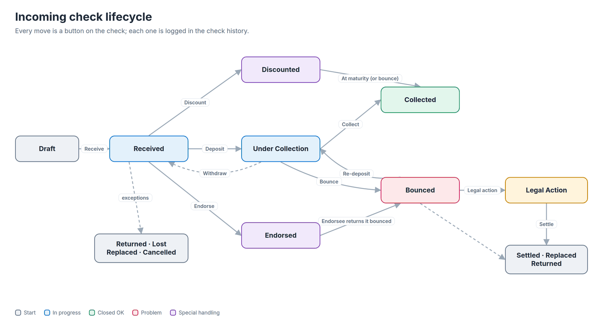

1. **Create**: *Operations → Incoming Checks → New*. Check number, customer, amount, issue and due dates, drawer bank and
   drawer account number (used for duplicate detection). Untick *Drawn by Partner* for a third-party check.
2. **Add Invoices** in the *Allocations* tab; amounts spread over installments, earliest due first. Anything unallocated
   is an advance.
3. **Receive**: entries are posted, invoices settled (default policy), the check goes to the default custody location and
   its identity fields lock.
4. **Deposit**: select received checks in the list (or open one) → **Deposit** → bank and slip number. Print the *Deposit Slip*.
5. **Collect** or **Bounce** on the deposit lines or the check. A bounce records the reason, bank reference, optional fee and
   evidence, and reopens the customer balance.
6. After a bounce: **Re-deposit**, **Legal Action**, **Replace** (allocations move to the new check), **Settled Otherwise**
   or **Return to Partner**.

Special cases: **Endorse** to a vendor against bills (**Endorsed Check Bounced** / **Returned by Endorsee** if it comes back),
**Discount at Bank** (then **Collect** / **Bounce** at maturity), guarantees (**Release Guarantee** / **Invoke Guarantee**),
**Lost**, **Cancel**, **Reset to Draft**.

| | |
|---|---|
| 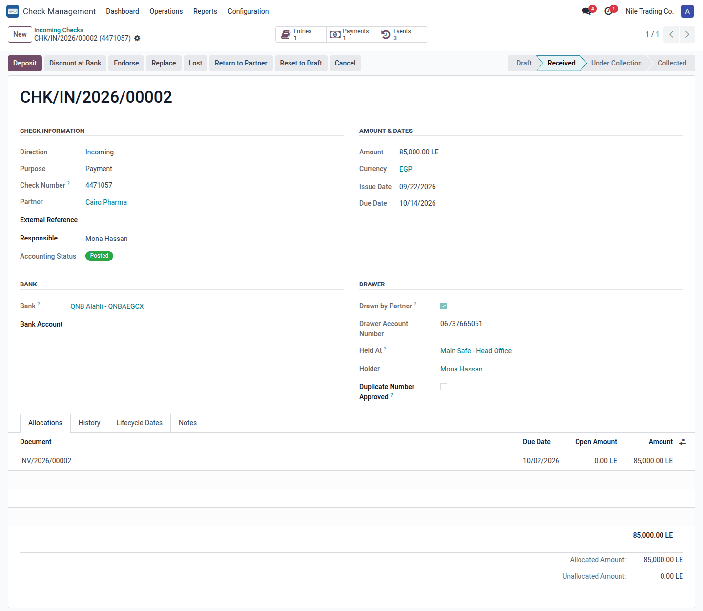 | 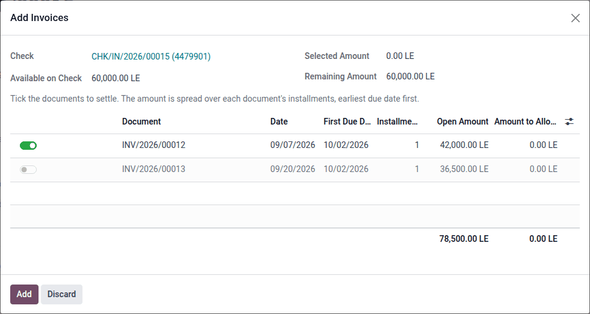 |
| 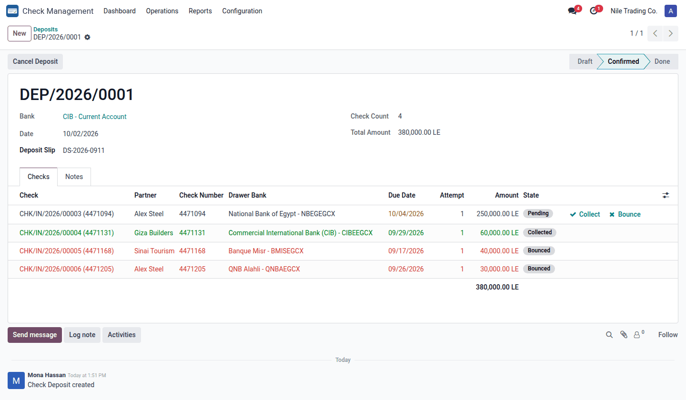 | 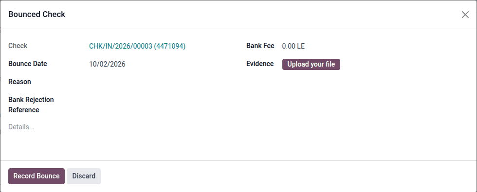 |
| 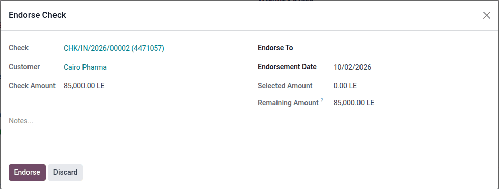 | 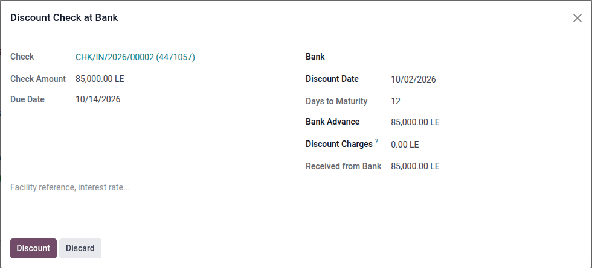 |

## Daily work: outgoing checks

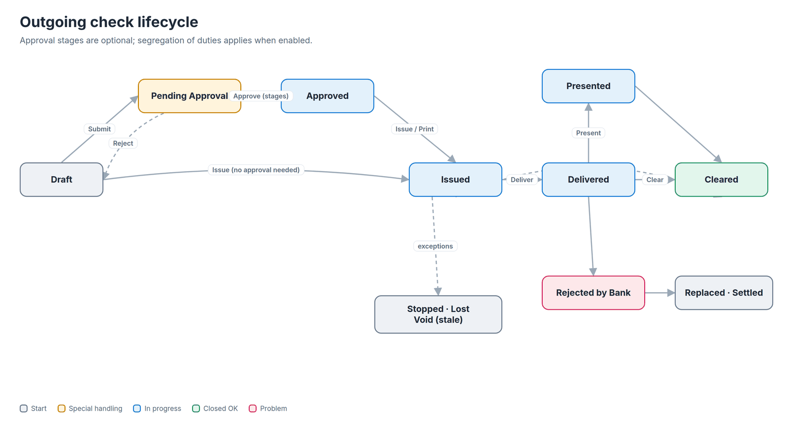

1. **Create**: *Operations → Outgoing Checks → New*. Vendor, amount, due date, bank journal and **Checkbook Leaf**
   (the number comes from the leaf).
2. **Add Bills** in the *Allocations* tab.
3. **Submit for Approval**; each stage's approver clicks **Approve** or **Reject**. With segregation on, nobody approves a
   check they created, submitted or already approved at an earlier stage.
4. **Print Check** (Check Printing add-on), then **Issue**: the bill is settled and the leaf is marked used.
5. **Deliver**, optionally **Mark Presented**, then **Mark Cleared** (or let the bank statement match clear it).
6. Exceptions: **Stop Payment**, **Rejected by Bank** (→ **Replace** / **Settled Otherwise**), **Lost**, **Void Stale Check**.

| | |
|---|---|
| 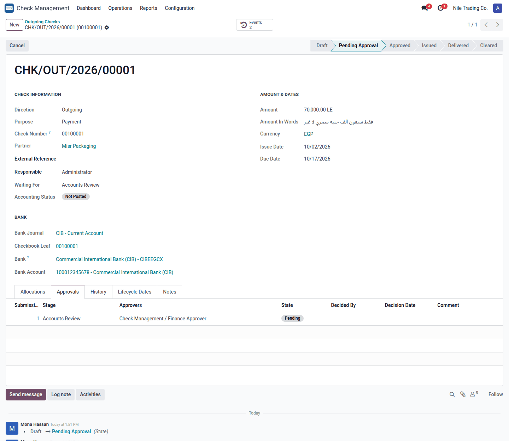 | 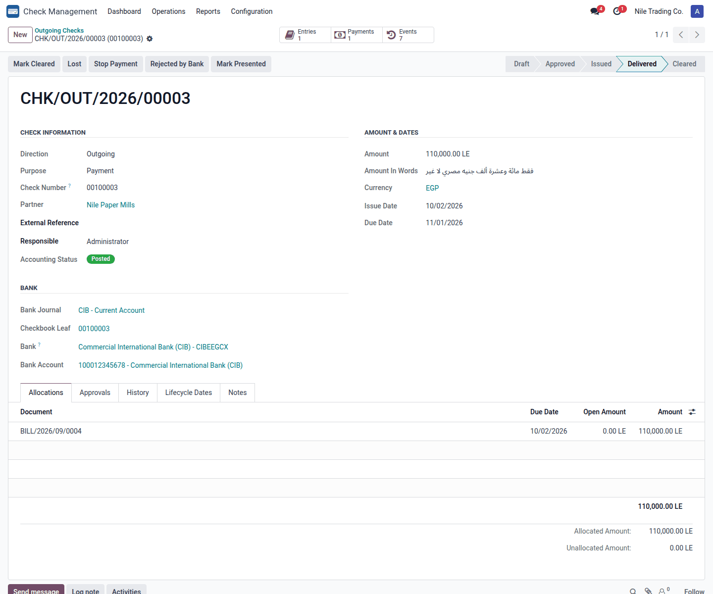 |

## Custody, approvals and history

- **Handovers** (*Operations → Handovers*): move checks between holders; the receiver **Accepts** or **Refuses**.
  Depositing moves a check to the bank automatically. Print the *Handover Receipt*.
- **Approval Requests** (*Operations → Approval Requests*): sensitive actions covered by a rule create a request;
  approvers get a to-do and click **Approve and Run** or **Reject**.
- **History**: every step is written to an immutable log (*Reports → Check History* and the *History* tab).
- **Accounting watch**: resetting, cancelling or unreconciling a check entry from Accounting flags the check
  *Needs Accounting Review*. Use **Repair Allocations** and **Mark Accounting Reviewed**.

| | |
|---|---|
| 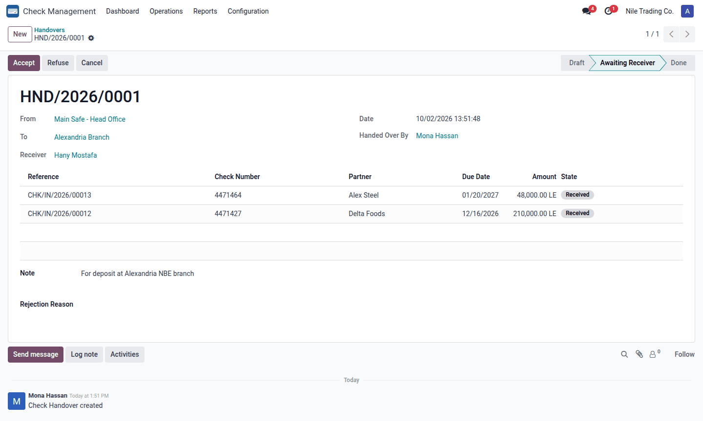 | 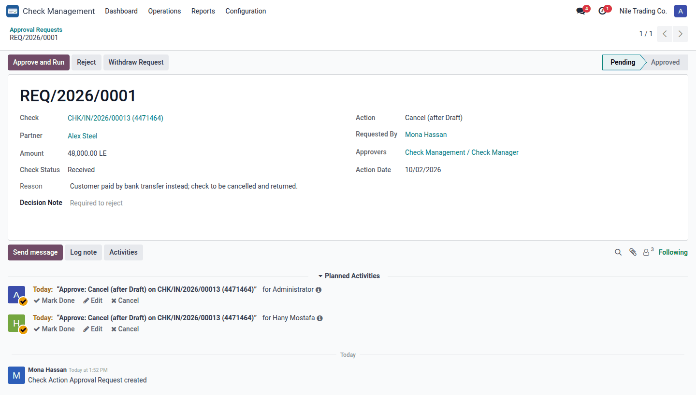 |

## Accounting

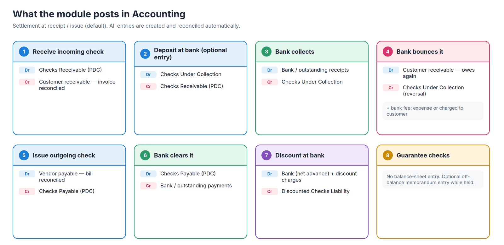

Reversals keep the original entry and add a reversal entry. Entries always use the exchange rate of their own date.

## Dashboard, reports and reminders

- **Dashboard**: outstanding, due today / 7 / 30 days, under collection, bounced, awaiting approval, guarantees held,
  collection rate, expected cash flow; click any figure to open the checks.
- **Reports**: Expected Cash Flow, Check Maturity, Bounce Analysis, Legal Cases, Check History.
- **PDF**: Check Voucher, Deposit Slip, Handover Receipt, Legal Case Sheet, partner Check Statement (button on the
  customer/vendor form).
- **Reminders**: the daily *Checks: daily reminders* job creates to-dos for checks due soon, matured checks not deposited,
  bounces, expiring guarantees, pending approvals, deposits without results and handovers not accepted, and escalates
  to Check Managers.

| | |
|---|---|
| 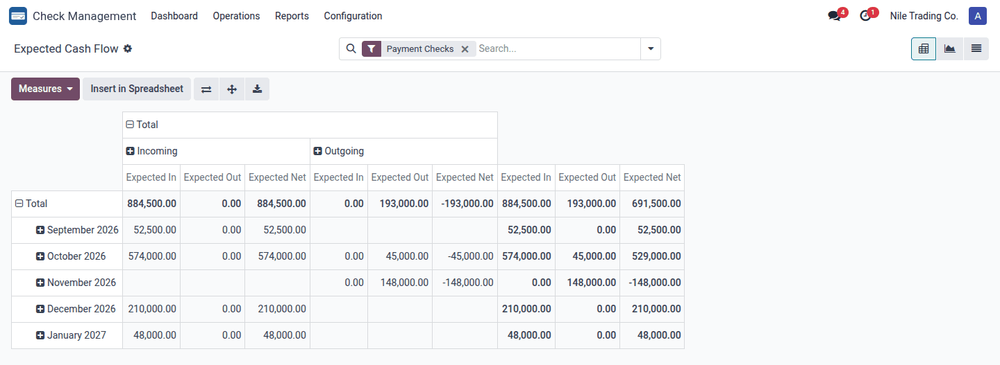 | 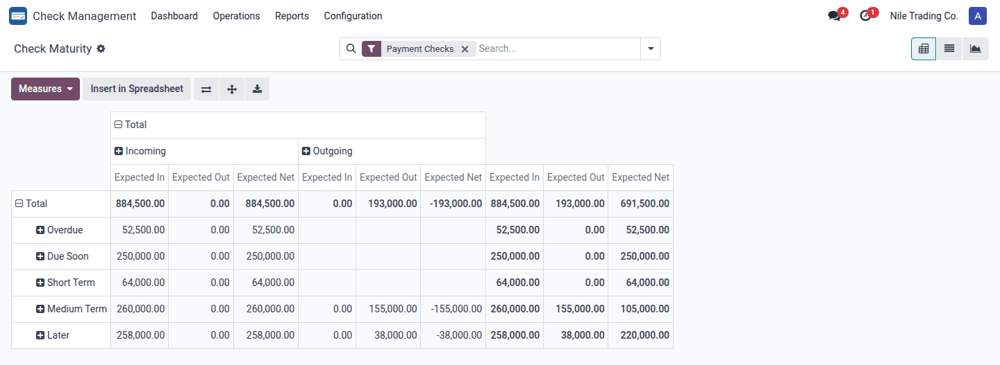 |
| 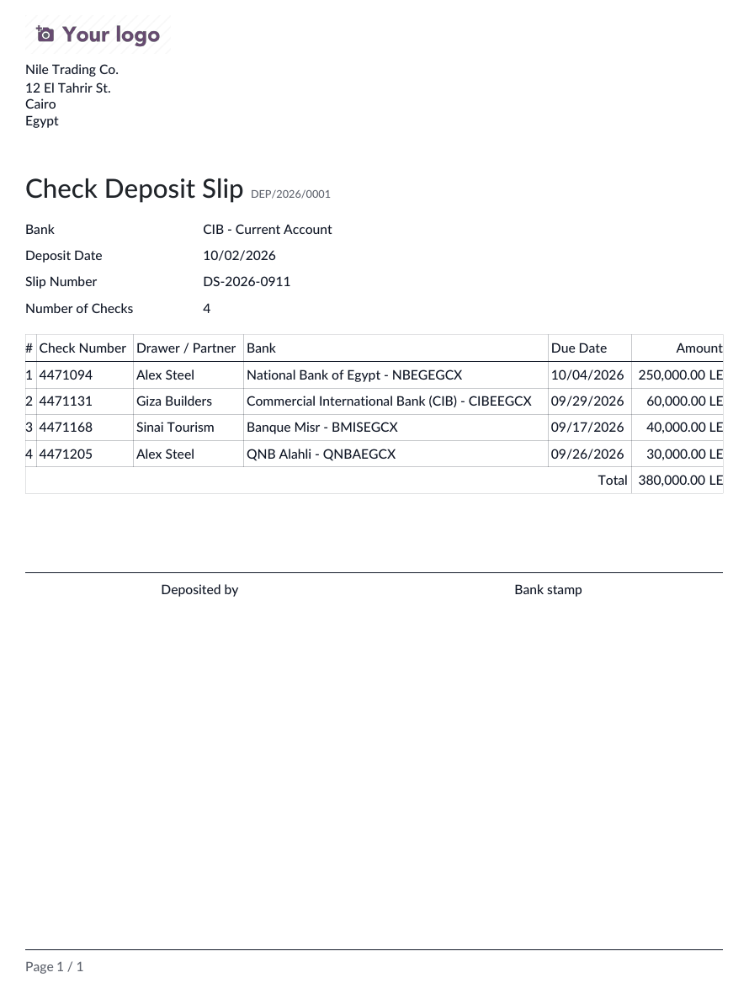 | 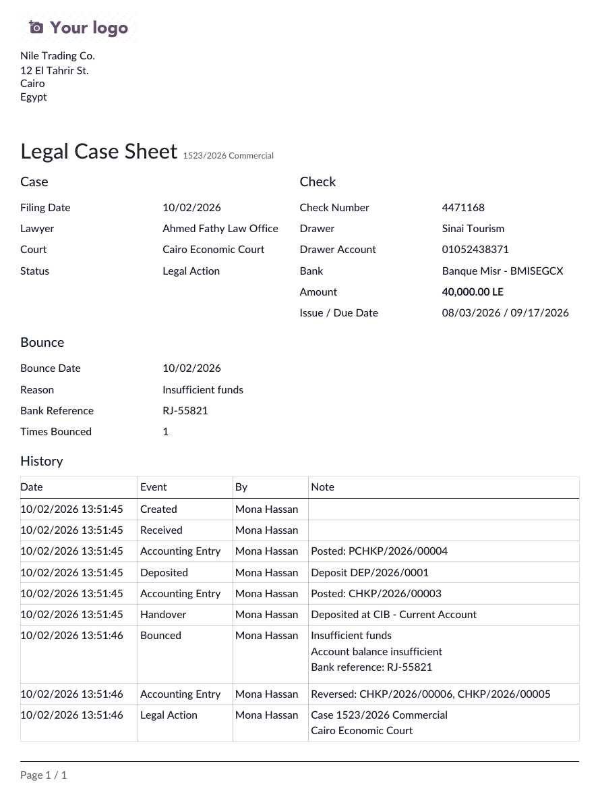 |

## Technical notes

- A check's state only changes through its actions. Each transition locks the row (`FOR UPDATE NOWAIT`), checks the
  user's role, validates the move, writes it and logs a `check.event`.
- Duplicate numbers are blocked per bank + drawer account (incoming) or per bank journal (outgoing), ignoring spaces,
  dashes and leading zeros; a Check Manager can approve a legitimate duplicate.
- Main models: `check.check`, `check.event`, `check.allocation`, `check.deposit`, `check.deposit.line`, `check.handover`,
  `check.location`, `check.book`, `check.book.line`, `check.approval.rule`, `check.approval.line`, `check.action.rule`,
  `check.action.request`, `check.endorsement.line`, `check.discount.term`, `check.bounce.reason`,
  `check.maturity.report` (SQL view).
- Tests: `odoo-bin -d <db> -i sa_check_management --test-tags /sa_check_management --stop-after-init`.
