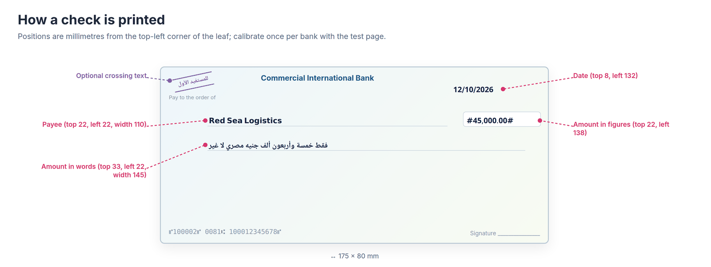
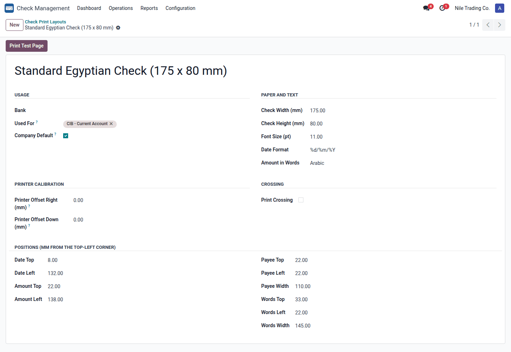
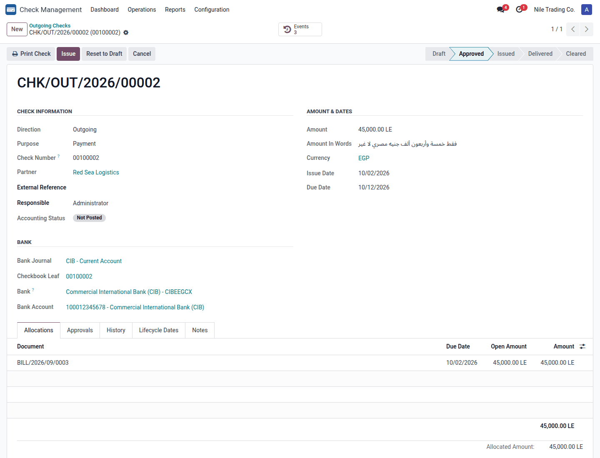
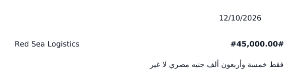

# Check Management - Check Printing

Print outgoing checks straight onto your bank's check leaves, with the amount in words in Arabic or English, one
calibrated layout per bank, and control over reprints.

| | |
|---|---|
| **Technical name** | `sa_check_management_print` |
| **Version** | 18.0.1.1.0 |
| **Depends on** | `sa_check_management` (Python: `num2words`) |
| **License** | OPL-1 |
| **Author** | Sayed Anwar |
| **User guides (PDF)** | [English](static/description/sa_check_management_print_user_guide_en.pdf) · [Arabic, Modern Standard](static/description/sa_check_management_print_user_guide_ar_msa.pdf) · [Arabic, Egyptian](static/description/sa_check_management_print_user_guide_ar.pdf) |

## Features

- **Layouts per bank**: paper size, font, date format and the position of every field in millimetres from the top-left
  corner of the leaf. A layout is linked to bank journals, or is the company default.
- **Printer calibration**: one right/down offset moves everything at once.
- **Amount in words**: commercial Arabic wording as written on Egyptian checks ("فقط ... لا غير") or English ("... Only"),
  for EGP, USD, EUR, SAR and AED; other currencies use their own unit labels.
- **Crossing text** (for example "للمستفيد الأول") at a chosen position.
- **Safe printing**: only approved checks print; Treasury Officers print once; only a Check Manager can reprint, after a
  confirmation. Each print is counted and logged in the check history.
- **Test page** on plain paper to calibrate against a real leaf.

## Set up

1. Install *Check Management - Check Printing*. A default layout, **Standard Egyptian Check (175 × 80 mm)**, is created
   as the company default.
2. *Check Management → Configuration → Check Print Layouts* (Check Manager).
3. Measure a real leaf and enter: check width/height (mm), the top/left position of the date, payee, amount in figures
   and amount in words, the widths of the payee and words areas, the font size, the date format (e.g. `%d/%m/%Y`) and the
   words language. Optionally enable **Print Crossing**.
4. **Used For**: the bank journals whose checks use this layout. One layout per bank whose leaf differs.
5. **Print Test Page** on plain paper, hold it against a real leaf and adjust. If everything is off by the same amount,
   use **Printer Offset Right / Down** (negative values move left / up).

## Print a check

1. Create the outgoing check (vendor, amount, due date, bank journal, checkbook leaf). The form shows the
   **Amount In Words** that will be printed.
2. Get it approved. It can be printed when **Approved** or **Issued**, or in Draft when the company does not require approval.
3. Load the leaf and click **Print Check** (Treasury Officer). The layout of the check's bank journal is used, else the
   company default.
4. **Issue** the check.
5. A Check Manager can **Reprint Check** after a confirmation; the reprint is logged as a copy.

The printed date is the check's due date, the payee is the vendor name, and the figures are framed like `#45,000.00#`.

| | |
|---|---|
|  |  |

## Rights

| Role | Printing rights |
|---|---|
| Check User | Sees layouts and the amount in words; cannot print |
| Treasury Officer | Prints approved checks once |
| Check Manager | Reprints; creates and edits layouts |

## Technical notes

- Model `check.print.layout`; each layout keeps its own `report.paperformat` in sync (zero margins, page = leaf size).
- Reports: `sa_check_management_print.report_check_print` (the check) and `report_check_layout_test` (test page).
- Adds the `printed` event type and `print_count`, `last_printed_date`, `amount_in_words` on `check.check`.
- Tests: `odoo-bin -d <db> -i sa_check_management_print --test-tags /sa_check_management_print --stop-after-init`.
