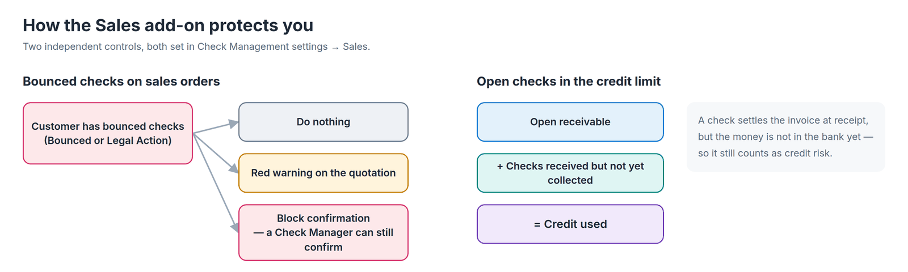
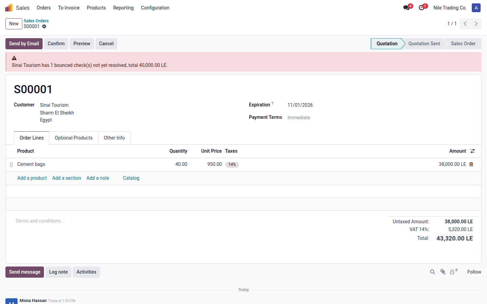
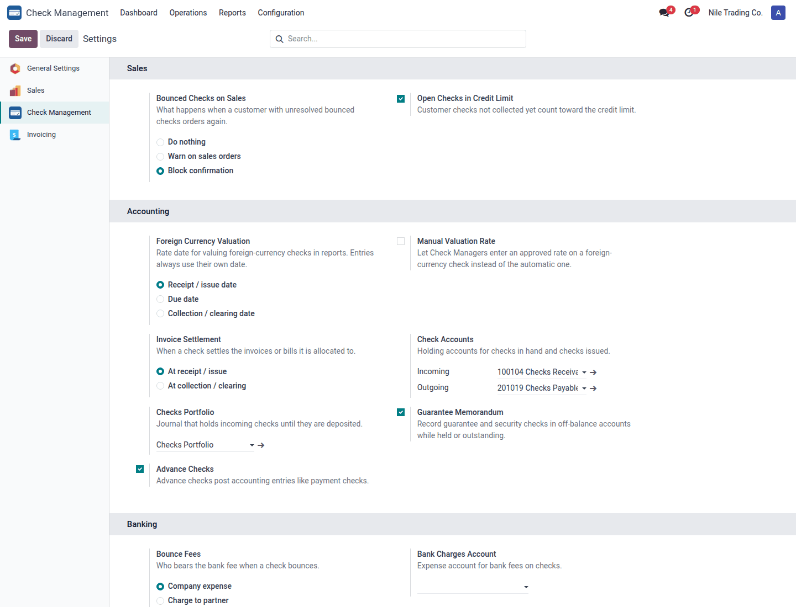

# Check Management - Sales

Stop selling on credit to customers whose checks bounced, and count checks that are not collected yet in the
customer's credit limit.

| | |
|---|---|
| **Technical name** | `sa_check_management_sale` |
| **Version** | 18.0.1.2.0 |
| **Depends on** | `sa_check_management`, `sale` (auto-installs) |
| **License** | OPL-1 |
| **Author** | Sayed Anwar |
| **User guides (PDF)** | [English](static/description/sa_check_management_sale_user_guide_en.pdf) · [Arabic, Modern Standard](static/description/sa_check_management_sale_user_guide_ar_msa.pdf) · [Arabic, Egyptian](static/description/sa_check_management_sale_user_guide_ar.pdf) |

## Features

- **Bounced checks on sales orders**: when the customer's company has incoming checks that are *Bounced* or under
  *Legal Action*, the quotation shows a red banner with the count and total. With **Block confirmation**, only a Check
  Manager can confirm the order.
- **Open checks in the credit limit**: checks that already settled invoices but are not collected yet (received, under
  collection, discounted) are added to the credit used in Odoo's credit-limit warning, with a line saying so.

## Set up

1. Install *Check Management* and *Sales*; this add-on installs itself.
2. *Check Management → Configuration → Settings* → **Sales** block.
3. **Bounced Checks on Sales**: *Do nothing*, *Warn on sales orders* (default) or *Block confirmation*.
4. **Open Checks in Credit Limit** (on by default). Works with Odoo's customer credit limit
   (*Accounting → Configuration → Settings → Customer Credit Limit*, and a limit on the customer).

## Good to know

- Only payment checks count; guarantee and security checks are ignored.
- A bounced check stops counting once it leaves Bounced / Legal Action (re-deposited, replaced, settled or returned).
- Checks are searched for the customer's commercial company, in the order's company.
- Only checks with a posted receipt entry count toward the credit limit.

## Technical notes

- Extends `sale.order.action_confirm` and `account.move._build_credit_warning_message`.
- Company fields: `check_sale_bounce_policy`, `check_sale_credit_include_checks`.
- Tests: `odoo-bin -d <db> -i sa_check_management_sale --test-tags /sa_check_management_sale --stop-after-init`.
